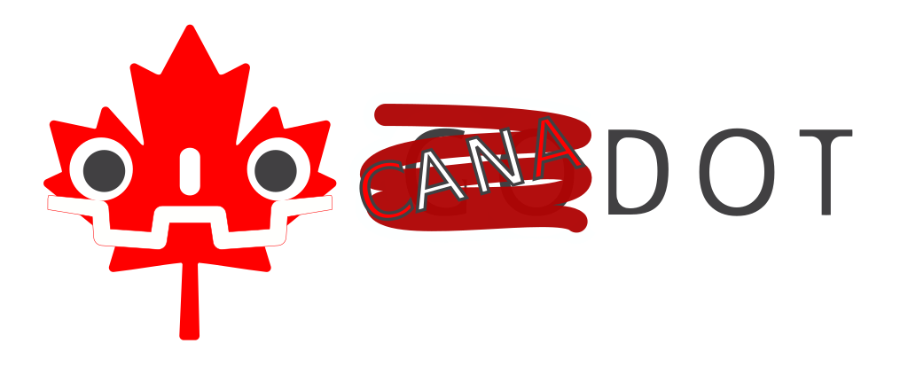

# Godot Engine

  

# Canadot Engine

  

Sometimes, us Canadians just can't get around the fact: Godot is not Canadian!

To many of us, it's a big deal breaker. Like, a *big* deal breaker.
So much so that we just can't handle it anymore.

Seeing as no Canadian has done so yet, simply because we're too complacent and humble to brag, I made a Canadian version of Godot, and I won't apologise for this one.

It's practically the same engine as Godot, however, it's tuned specifically for us Canadians.

Original Godot Engine: https://github.com/godotengine/godot (not Canadian)
